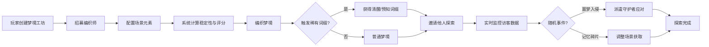

## 1. 产品概述

梦境编织与潜意识探索系统是一款多人在线魔法世界Web游戏，玩家创建梦境工坊、招募编织师构建独特梦境场景，邀请他人探索并进行实时对战。系统支持梦境交易、公会建设、联赛竞技等丰富玩法，高峰期可承载数千玩家同时在线编织与探索。

- 核心价值：让玩家体验沉浸式梦境创造与探索乐趣，通过社交互动和竞技玩法增强用户粘性
- 目标用户：喜欢策略养成、社交互动和轻度竞技的Web游戏玩家
- 市场定位：结合模拟经营、卡牌收集和实时对战的创新魔法题材Web游戏

## 2. 核心 Features

### 2.1 用户角色

| 角色 | 注册方式 | 核心权限 |
|------|----------|----------|
| 普通玩家 | 一键注册/游客登录 | 创建梦境工坊、探索他人梦境、参加联赛、交易、加入公会 |
| 公会会长 | 达到指定等级创建 | 管理公会成员、建设公会建筑、发起公会活动 |
| 管理员 | 后台账号 | 配置游戏参数、管理交易市场、发布全服公告 |

### 2.2 功能模块

1. **梦境工坊页面**：工坊管理、编织师招募、场景元素配置、梦境编织计算
2. **梦境探索页面**：访客列表、实时数据监控、随机事件处理、守护者派遣
3. **联赛竞技场页面**：对手匹配、实时对战、技能释放、奖励结算
4. **交易市场页面**：梦境蓝图交易、守护者契约交易、价格建议、成交公告
5. **公会中心页面**：联合梦境塔、潜意识研究厅、成员贡献管理、公会升级
6. **数据报告页面**：周度产业报告、热力图、稳定性曲线、PDF导出
7. **排行榜页面**：梦境收藏榜、探索积分榜、公会贡献榜
8. **玩家主页**：个人信息、梦境收藏、成就展示、好友列表

### 2.3 页面详情

| 页面名称 | 模块名称 | 功能描述 |
|----------|----------|----------|
| 梦境工坊 | 编织师管理 | 招募/解雇编织师、查看技能属性、升级培养 |
| 梦境工坊 | 场景编辑器 | 拖放元素组件、预览场景效果、保存梦境蓝图 |
| 梦境工坊 | 编织计算器 | 实时显示稳定性/评分、词缀概率预览、一键编织 |
| 梦境探索 | 访客监控面板 | 实时显示潜意识值、情绪波动、梦境能量数值 |
| 梦境探索 | 事件处理中心 | 噩梦入侵/记忆碎片事件弹窗、派遣守护者/调整场景 |
| 联赛竞技场 | 匹配大厅 | 按梦境复杂度匹配、等待队列、快速开始 |
| 联赛竞技场 | 实时对战面板 | 双方能量条、技能冷却CD、战斗日志、清醒一击等技能 |
| 联赛竞技场 | 奖励结算 | 积分统计、梦之碎片发放、战绩记录 |
| 交易市场 | 商品列表 | 分类筛选、价格排序、收藏商品、一键购买 |
| 交易市场 | 发布商品 | 定价输入、系统价格区间建议、上架/下架管理 |
| 公会中心 | 建筑管理 | 联合梦境塔升级、潜意识研究厅升级、贡献进度 |
| 公会中心 | 成员管理 | 成员列表、贡献统计、职位调整、申请审核 |
| 数据报告 | 周报告面板 | 场景热度热力图、稳定性曲线、交易价格走势图 |
| 数据报告 | PDF导出 | 梦境能量雷达图、趋势图、一键生成下载 |
| 排行榜 | 多维度榜单 | 收藏榜/积分榜/贡献榜切换、前三名展示、翻页浏览 |

## 3. 核心流程

### 3.1 梦境编织流程
玩家进入梦境工坊 → 招募/选择编织师 → 拖拽配置场景元素 → 系统计算稳定性与评分 → 确认编织 → 概率触发稀有词缀 → 梦境创建成功 → 可邀请他人探索

### 3.2 梦境探索流程
玩家收到邀请/浏览公开梦境 → 进入梦境 → 实时更新潜意识/情绪/能量数据 → 随机触发事件 → 选择应对方式（派遣守护者/调整场景）→ 探索结束获得积分 → 可收藏梦境

### 3.3 联赛对战流程
玩家进入竞技场 → 选择参赛梦境 → 系统按复杂度匹配对手 → 匹配成功进入对战 → 实时更新双方能量与技能CD → 释放技能干扰对方 → 倒计时结束 → 按梦境能量判定胜负 → 发放积分与碎片奖励

### 3.4 交易流程
卖家选择蓝图/契约 → 输入定价 → 系统显示近7天均价建议区间 → 确认上架 → 全服广播 → 买家浏览/搜索 → 一键购买 → 系统结算 → 触发梦魇潮汐事件 → 全服梦境稳定性波动

## 4. 用户界面设计

### 4.1 设计风格
- **设计基调**：神秘魔幻主义，深邃梦境主题
- **主色调**：深紫色 `#2D1B69` 搭配梦幻蓝 `#4ECDC4`、星光金 `#FFD166`、梦魇红 `#EF476F`
- **辅助色**：梦境绿 `#06D6A0`、潜意识紫 `#9B5DE5`
- **按钮风格**：渐变填充+微光边框，圆角12px，悬浮时有发光动画
- **字体**：标题使用 'Cinzel Decorative' 衬线字体，正文使用 'Noto Serif SC' 中文衬线
- **布局风格**：卡片式层叠布局，半透明玻璃拟态效果，元素间有微妙重叠
- **图标风格**：手绘魔法符文风格，微光描边，悬浮时有旋转动画

### 4.2 页面设计概览

| 页面名称 | 模块名称 | UI 元素与设计 |
|----------|----------|--------------|
| 梦境工坊 | 编织师卡片 | 玻璃拟态卡片、编织师立绘、技能标签、稀有度光效 |
| 梦境工坊 | 场景编辑器 | 六边形网格画布、元素图标拖放、实时预览3D缩略图 |
| 梦境工坊 | 编织计算器 | 弧形进度条展示稳定性、星级评分、词缀概率条 |
| 梦境探索 | 实时数据面板 | 能量流动环形图、情绪波动折线、数值跳动动画 |
| 梦境探索 | 事件弹窗 | 全屏暗色遮罩、动态边框、震动动画、倒计时 |
| 联赛竞技场 | 对战面板 | 左右对称能量柱、技能图标冷却遮罩、战斗弹幕效果 |
| 联赛竞技场 | 匹配动画 | 旋转魔法阵、粒子特效、匹配成功时的冲击波 |
| 交易市场 | 价格建议 | 区间滑块、7天价格曲线、最优定价标记 |
| 交易市场 | 成交公告 | 全服滚动横幅、金色边框、渐隐动画 |
| 公会中心 | 建筑升级 | 3D建筑模型、经验条、贡献进度圆环 |
| 数据报告 | 热力图 | 渐变色块、hover显示详情、时间轴播放动画 |
| 数据报告 | PDF导出 | 加载动画、预览缩略图、下载进度条 |
| 排行榜 | 榜单展示 | 金色/银色/铜色奖牌、前三名放大展示、排行变化箭头 |

### 4.3 响应式设计
- 采用 Desktop-first 设计，优先保障1920×1080分辨率体验
- 1366×768：调整间距，优化两列布局
- 平板端：自适应为单列布局，侧边栏改为底部导航
- 移动端：核心功能保留（梦境编织、探索、联赛），简化数据展示

### 4.4 视觉特效与动画
- **背景**：深邃星空背景，流动星云粒子，鼠标移动产生视差效果
- **梦境能量**：发光粒子流，沿路径流动，碰撞时产生火花
- **页面切换**：淡入淡出+轻微缩放过渡，新元素从底部滑入
- **按钮交互**：hover时缩放1.05倍+外发光，点击时波纹扩散
- **稀有词缀触发**：全屏光芒闪烁，文字旋转出现，音效同步
- **技能释放**：能量球发射轨迹，命中时爆炸粒子效果
- **数据更新**：数值变化时数字滚动，颜色渐变提示增减

### 4.5 3D 场景设计
- 梦境工坊场景：悬浮岛屿，飘浮的梦之碎片，魔法光束照射
- 对战场景：双方梦境空间对立，中间能量屏障，星空背景
- 公会建筑：旋转的联合梦境塔，飘浮的研究厅，成员贡献粒子汇聚
- 光照：环境光+定向主光源+点光源补充，HDR环境贴图营造氛围
- 相机：轻微轨道动画，交互时平滑过渡
- 后处理：Bloom泛光、Vignette暗角、轻微色偏
