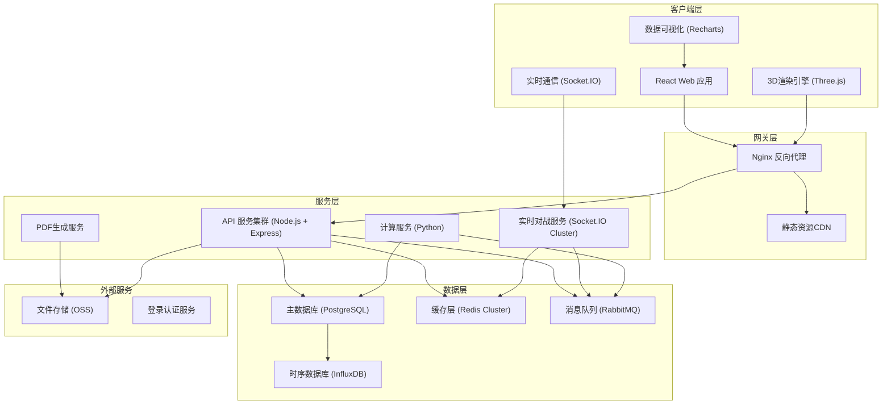
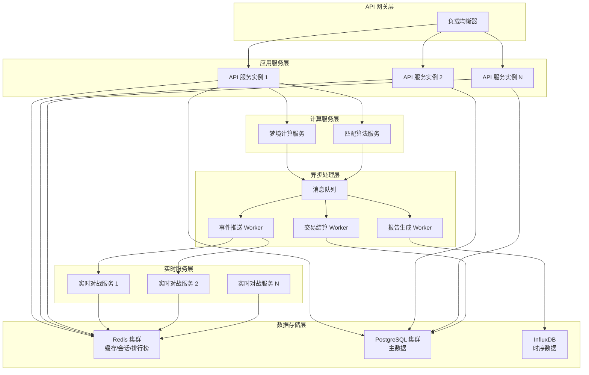
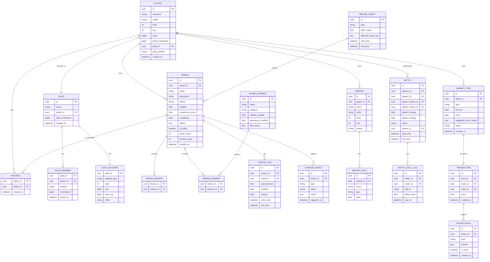

## 1. 架构设计



## 2. 技术选型说明

| 层级 | 技术选型 | 版本 | 用途说明 |
|------|----------|------|----------|
| 前端框架 | React | 18.x | 组件化开发，配合 Hooks 管理状态 |
| 构建工具 | Vite | 5.x | 快速开发构建，支持热更新 |
| 样式方案 | TailwindCSS | 3.x | 原子化CSS，快速构建UI |
| 状态管理 | Zustand | 4.x | 轻量级状态管理，支持中间件持久化 |
| 3D引擎 | Three.js | 0.160.x | 梦境场景3D渲染 |
| React-Three-Fiber | @react-three/fiber | 8.x | React 声明式 Three.js 封装 |
| React-Three-Drei | @react-three/drei | 9.x | 常用3D组件库 |
| 后处理 | @react-three/postprocessing | 2.x | Bloom、泛光等特效 |
| 图表库 | Recharts | 2.x | 热力图、折线图、雷达图 |
| 动画库 | Framer Motion | 11.x | 页面动画、微交互 |
| PDF生成 | jspdf | 2.x | 客户端PDF导出 |
| 实时通信 | Socket.IO | 4.x | 实时对战、数据推送 |
| 后端 | Node.js + Express | 4.x | RESTful API 服务 |
| 计算服务 | Python + FastAPI | - | 梦境稳定性计算、匹配算法 |
| 主数据库 | PostgreSQL | 15.x | 玩家数据、梦境数据、交易记录 |
| 缓存 | Redis | 7.x | 会话、排行榜、实时数据缓存 |
| 消息队列 | RabbitMQ | 3.x | 异步任务、事件驱动 |
| 时序数据 | InfluxDB | 2.x | 稳定性曲线、价格走势存储 |
| 对象存储 | OSS/S3 | - | 梦境蓝图、用户头像存储 |

## 3. 路由定义

| 路由路径 | 页面名称 | 权限要求 | 说明 |
|----------|----------|----------|------|
| `/` | 首页/大厅 | 公开 | 游戏入口、公告、快速入口 |
| `/workshop` | 梦境工坊 | 登录 | 编织师管理、场景编辑、梦境编织 |
| `/explore/:dreamId` | 梦境探索 | 登录 | 进入梦境、实时监控、事件处理 |
| `/arena` | 联赛大厅 | 登录 | 匹配队列、战绩查看 |
| `/arena/battle/:battleId` | 实时对战 | 登录 | 对战面板、技能释放 |
| `/market` | 交易市场 | 登录 | 商品列表、购买、发布商品 |
| `/guild` | 公会中心 | 登录 | 公会建筑、成员管理、贡献 |
| `/reports` | 数据报告 | 登录 | 周报告查看、PDF导出 |
| `/rankings` | 排行榜 | 公开 | 多维度榜单展示 |
| `/profile/:userId` | 玩家主页 | 登录 | 个人信息、收藏、成就 |
| `/login` | 登录页 | 公开 | 一键注册/登录 |

## 4. API 定义

### 4.1 类型定义

```typescript
// 玩家基础信息
interface Player {
  id: string;
  nickname: string;
  avatar: string;
  level: number;
  exp: number;
  coins: number;
  dreamFragments: number;
  guildId?: string;
  guildPosition?: 'member' | 'officer' | 'leader';
}

// 编织师
interface Weaver {
  id: string;
  name: string;
  rarity: 'common' | 'rare' | 'epic' | 'legendary';
  skills: WeaverSkill[];
  level: number;
  exp: number;
  avatar: string;
}

interface WeaverSkill {
  id: string;
  name: string;
  description: string;
  type: 'stability' | 'experience' | 'affix_chance';
  value: number;
}

// 场景元素
interface SceneElement {
  id: string;
  name: string;
  category: 'plant' | 'architecture' | 'creature' | 'weather' | 'time';
  stabilityModifier: number;
  experienceModifier: number;
  affixBonus: Record<string, number>;
}

// 梦境
interface Dream {
  id: string;
  ownerId: string;
  name: string;
  description: string;
  theme: string;
  weavers: string[];
  elements: string[];
  stability: number;
  experienceScore: number;
  affixes: string[];
  complexity: number;
  isPublic: boolean;
  visitorCount: number;
  favoriteCount: number;
  createdAt: string;
}

// 访客实时数据
interface VisitorData {
  playerId: string;
  dreamId: string;
  subconscious: number;
  emotion: number;
  energy: number;
  enterTime: string;
}

// 对战数据
interface Battle {
  id: string;
  player1Id: string;
  player2Id: string;
  player1Dream: Dream;
  player2Dream: Dream;
  player1Energy: number;
  player2Energy: number;
  player1Skills: BattleSkill[];
  player2Skills: BattleSkill[];
  status: 'waiting' | 'fighting' | 'finished';
  winnerId?: string;
  startTime: string;
  endTime?: string;
}

interface BattleSkill {
  id: string;
  name: string;
  cooldown: number;
  currentCooldown: number;
  effect: SkillEffect;
}

// 交易商品
interface MarketItem {
  id: string;
  sellerId: string;
  type: 'blueprint' | 'guardian';
  itemId: string;
  itemData: object;
  price: number;
  suggestedPriceRange: [number, number];
  createdAt: string;
  status: 'active' | 'sold' | 'expired';
}

// 公会
interface Guild {
  id: string;
  name: string;
  leaderId: string;
  members: GuildMember[];
  dreamTower: GuildBuilding;
  researchHall: GuildBuilding;
  totalContribution: number;
}

interface GuildBuilding {
  level: number;
  exp: number;
  maxExp: number;
  effect: string;
}
```

### 4.2 核心 API 列表

| API 路径 | 方法 | 说明 | 请求体 | 响应 |
|----------|------|------|--------|------|
| `/api/auth/login` | POST | 登录 | `{type: 'guest' \| 'account', credential?: string}` | `{token: string, player: Player}` |
| `/api/workshop/weavers` | GET | 获取编织师列表 | - | `Weaver[]` |
| `/api/workshop/weavers/recruit` | POST | 招募编织师 | `{cost: number}` | `Weaver` |
| `/api/workshop/elements` | GET | 获取场景元素库 | - | `SceneElement[]` |
| `/api/workshop/calculate` | POST | 计算梦境参数 | `{weaverIds: string[], elementIds: string[]}` | `{stability: number, score: number, affixChances: Record<string, number>}` |
| `/api/workshop/weave` | POST | 编织梦境 | `{name: string, description: string, theme: string, weaverIds: string[], elementIds: string[], isPublic: boolean}` | `Dream` |
| `/api/dreams` | GET | 获取公开梦境列表 | `{page: number, pageSize: number, sortBy: string}` | `{items: Dream[], total: number}` |
| `/api/dreams/:id` | GET | 获取梦境详情 | - | `Dream` |
| `/api/dreams/:id/enter` | POST | 进入梦境 | - | `{visitorId: string, enterTime: string}` |
| `/api/dreams/:id/events` | GET | 获取事件流 (SSE) | - | `ServerSentEvent` |
| `/api/dreams/:id/events/handle` | POST | 处理随机事件 | `{eventId: string, action: 'guardian' \| 'adjust'}` | `{result: string, reward?: object}` |
| `/api/arena/match` | POST | 开始匹配 | `{dreamId: string}` | `{matchId: string, status: 'matching'}` |
| `/api/arena/match/:id/status` | GET | 匹配状态 | - | `{status: 'matching' \| 'success' \| 'failed', battleId?: string}` |
| `/api/arena/battles/:id` | GET | 获取对战详情 | - | `Battle` |
| `/api/arena/battles/:id/skill` | POST | 释放技能 | `{skillId: string, targetPlayerId: string}` | `{success: boolean, newEnergy: number}` |
| `/api/market/items` | GET | 获取商品列表 | `{type?: string, sortBy?: string, page: number}` | `{items: MarketItem[], total: number}` |
| `/api/market/items/suggest-price` | POST | 获取价格建议 | `{type: string, itemId: string}` | `{avgPrice: number, suggestedRange: [number, number]}` |
| `/api/market/items/publish` | POST | 发布商品 | `{type: string, itemId: string, price: number}` | `MarketItem` |
| `/api/market/items/:id/buy` | POST | 购买商品 | - | `{success: boolean, item: object}` |
| `/api/guild` | GET | 获取公会信息 | - | `Guild` |
| `/api/guild/building/:type/upgrade` | POST | 升级建筑 | `{materials: object, coins: number}` | `GuildBuilding` |
| `/api/reports/weekly` | GET | 获取周报告 | - | `{heatmap: object, stabilityCurve: object[], priceTrend: object[]}` |
| `/api/reports/weekly/export` | GET | 导出PDF | - | `PDF文件流` |
| `/api/rankings` | GET | 获取排行榜 | `{type: 'favorite' \| 'points' \| 'contribution', page: number}` | `{items: object[], total: number}` |
| `/api/player/:id` | GET | 获取玩家信息 | - | `{player: Player, dreams: Dream[], favorites: string[]}` |

## 5. 服务端架构



## 6. 数据模型

### 6.1 ER 图



### 6.2 DDL 语句

```sql
-- 创建玩家表
CREATE TABLE players (
    id UUID PRIMARY KEY DEFAULT gen_random_uuid(),
    nickname VARCHAR(50) NOT NULL,
    avatar VARCHAR(255),
    level INT NOT NULL DEFAULT 1,
    exp BIGINT NOT NULL DEFAULT 0,
    coins BIGINT NOT NULL DEFAULT 1000,
    dream_fragments BIGINT NOT NULL DEFAULT 0,
    guild_id UUID,
    guild_position VARCHAR(20),
    created_at TIMESTAMPTZ NOT NULL DEFAULT NOW(),
    INDEX idx_guild_id (guild_id),
    INDEX idx_level (level)
);

-- 创建编织师表
CREATE TABLE weavers (
    id UUID PRIMARY KEY DEFAULT gen_random_uuid(),
    player_id UUID NOT NULL REFERENCES players(id),
    name VARCHAR(50) NOT NULL,
    rarity VARCHAR(20) NOT NULL CHECK (rarity IN ('common', 'rare', 'epic', 'legendary')),
    level INT NOT NULL DEFAULT 1,
    exp INT NOT NULL DEFAULT 0,
    avatar VARCHAR(255),
    created_at TIMESTAMPTZ NOT NULL DEFAULT NOW(),
    INDEX idx_player_id (player_id),
    INDEX idx_rarity (rarity)
);

-- 创建编织师技能表
CREATE TABLE weaver_skills (
    id UUID PRIMARY KEY DEFAULT gen_random_uuid(),
    weaver_id UUID NOT NULL REFERENCES weavers(id),
    name VARCHAR(50) NOT NULL,
    type VARCHAR(30) NOT NULL CHECK (type IN ('stability', 'experience', 'affix_chance')),
    value FLOAT NOT NULL,
    INDEX idx_weaver_id (weaver_id)
);

-- 创建场景元素表
CREATE TABLE scene_elements (
    id UUID PRIMARY KEY DEFAULT gen_random_uuid(),
    name VARCHAR(50) NOT NULL,
    category VARCHAR(30) NOT NULL CHECK (category IN ('plant', 'architecture', 'creature', 'weather', 'time')),
    stability_modifier FLOAT NOT NULL DEFAULT 0,
    experience_modifier FLOAT NOT NULL DEFAULT 0,
    affix_bonus JSONB,
    created_at TIMESTAMPTZ NOT NULL DEFAULT NOW()
);

-- 创建梦境表
CREATE TABLE dreams (
    id UUID PRIMARY KEY DEFAULT gen_random_uuid(),
    owner_id UUID NOT NULL REFERENCES players(id),
    name VARCHAR(100) NOT NULL,
    description TEXT,
    theme VARCHAR(50) NOT NULL,
    stability FLOAT NOT NULL,
    experience_score FLOAT NOT NULL,
    complexity FLOAT NOT NULL,
    affixes JSONB,
    is_public BOOLEAN NOT NULL DEFAULT TRUE,
    visitor_count INT NOT NULL DEFAULT 0,
    favorite_count INT NOT NULL DEFAULT 0,
    created_at TIMESTAMPTZ NOT NULL DEFAULT NOW(),
    INDEX idx_owner_id (owner_id),
    INDEX idx_theme (theme),
    INDEX idx_stability (stability),
    INDEX idx_complexity (complexity),
    INDEX idx_created_at (created_at DESC)
);

-- 创建梦境编织师关联表
CREATE TABLE dream_weavers (
    dream_id UUID NOT NULL REFERENCES dreams(id) ON DELETE CASCADE,
    weaver_id UUID NOT NULL REFERENCES weavers(id),
    PRIMARY KEY (dream_id, weaver_id)
);

-- 创建梦境场景元素关联表
CREATE TABLE dream_elements (
    dream_id UUID NOT NULL REFERENCES dreams(id) ON DELETE CASCADE,
    element_id UUID NOT NULL REFERENCES scene_elements(id),
    PRIMARY KEY (dream_id, element_id)
);

-- 创建访客日志表
CREATE TABLE visitor_logs (
    id UUID PRIMARY KEY DEFAULT gen_random_uuid(),
    dream_id UUID NOT NULL REFERENCES dreams(id),
    visitor_id UUID NOT NULL REFERENCES players(id),
    subconscious FLOAT NOT NULL,
    emotion FLOAT NOT NULL,
    energy FLOAT NOT NULL,
    enter_time TIMESTAMPTZ NOT NULL DEFAULT NOW(),
    exit_time TIMESTAMPTZ,
    INDEX idx_dream_id (dream_id),
    INDEX idx_visitor_id (visitor_id),
    INDEX idx_enter_time (enter_time DESC)
);

-- 创建随机事件表
CREATE TABLE random_events (
    id UUID PRIMARY KEY DEFAULT gen_random_uuid(),
    dream_id UUID NOT NULL REFERENCES dreams(id),
    type VARCHAR(30) NOT NULL CHECK (type IN ('nightmare', 'memory_fragment')),
    status VARCHAR(20) NOT NULL DEFAULT 'pending' CHECK (status IN ('pending', 'resolved', 'failed')),
    result JSONB,
    triggered_at TIMESTAMPTZ NOT NULL DEFAULT NOW(),
    INDEX idx_dream_id (dream_id),
    INDEX idx_status (status)
);

-- 创建对战表
CREATE TABLE battles (
    id UUID PRIMARY KEY DEFAULT gen_random_uuid(),
    player1_id UUID NOT NULL REFERENCES players(id),
    player2_id UUID NOT NULL REFERENCES players(id),
    player1_dream_id UUID NOT NULL REFERENCES dreams(id),
    player2_dream_id UUID NOT NULL REFERENCES dreams(id),
    player1_energy FLOAT NOT NULL DEFAULT 100,
    player2_energy FLOAT NOT NULL DEFAULT 100,
    status VARCHAR(20) NOT NULL DEFAULT 'waiting' CHECK (status IN ('waiting', 'fighting', 'finished')),
    winner_id UUID REFERENCES players(id),
    start_time TIMESTAMPTZ NOT NULL DEFAULT NOW(),
    end_time TIMESTAMPTZ,
    INDEX idx_status (status),
    INDEX idx_player1_id (player1_id),
    INDEX idx_player2_id (player2_id),
    INDEX idx_start_time (start_time DESC)
);

-- 创建对战技能日志表
CREATE TABLE battle_skill_logs (
    id UUID PRIMARY KEY DEFAULT gen_random_uuid(),
    battle_id UUID NOT NULL REFERENCES battles(id),
    caster_id UUID NOT NULL REFERENCES players(id),
    skill_id VARCHAR(50) NOT NULL,
    effect_value FLOAT NOT NULL,
    cast_at TIMESTAMPTZ NOT NULL DEFAULT NOW(),
    INDEX idx_battle_id (battle_id),
    INDEX idx_caster_id (caster_id)
);

-- 创建交易商品表
CREATE TABLE market_items (
    id UUID PRIMARY KEY DEFAULT gen_random_uuid(),
    seller_id UUID NOT NULL REFERENCES players(id),
    type VARCHAR(20) NOT NULL CHECK (type IN ('blueprint', 'guardian')),
    item_id UUID NOT NULL,
    price FLOAT NOT NULL,
    suggested_price_range JSONB NOT NULL,
    status VARCHAR(20) NOT NULL DEFAULT 'active' CHECK (status IN ('active', 'sold', 'expired')),
    created_at TIMESTAMPTZ NOT NULL DEFAULT NOW(),
    INDEX idx_seller_id (seller_id),
    INDEX idx_type (type),
    INDEX idx_status (status),
    INDEX idx_price (price)
);

-- 创建交易记录表
CREATE TABLE transactions (
    id UUID PRIMARY KEY DEFAULT gen_random_uuid(),
    item_id UUID NOT NULL REFERENCES market_items(id),
    buyer_id UUID NOT NULL REFERENCES players(id),
    seller_id UUID NOT NULL REFERENCES players(id),
    price FLOAT NOT NULL,
    created_at TIMESTAMPTZ NOT NULL DEFAULT NOW(),
    INDEX idx_buyer_id (buyer_id),
    INDEX idx_seller_id (seller_id),
    INDEX idx_created_at (created_at DESC)
);

-- 创建公会表
CREATE TABLE guilds (
    id UUID PRIMARY KEY DEFAULT gen_random_uuid(),
    name VARCHAR(50) NOT NULL UNIQUE,
    leader_id UUID NOT NULL REFERENCES players(id),
    total_contribution BIGINT NOT NULL DEFAULT 0,
    created_at TIMESTAMPTZ NOT NULL DEFAULT NOW(),
    INDEX idx_leader_id (leader_id)
);

-- 创建公会成员表
CREATE TABLE guild_members (
    guild_id UUID NOT NULL REFERENCES guilds(id) ON DELETE CASCADE,
    player_id UUID NOT NULL UNIQUE REFERENCES players(id),
    position VARCHAR(20) NOT NULL DEFAULT 'member' CHECK (position IN ('member', 'officer', 'leader')),
    contribution BIGINT NOT NULL DEFAULT 0,
    joined_at TIMESTAMPTZ NOT NULL DEFAULT NOW(),
    PRIMARY KEY (guild_id, player_id),
    INDEX idx_guild_id (guild_id)
);

-- 创建公会建筑表
CREATE TABLE guild_buildings (
    guild_id UUID NOT NULL REFERENCES guilds(id) ON DELETE CASCADE,
    building_type VARCHAR(30) NOT NULL CHECK (building_type IN ('dream_tower', 'research_hall')),
    level INT NOT NULL DEFAULT 1,
    exp BIGINT NOT NULL DEFAULT 0,
    max_exp BIGINT NOT NULL DEFAULT 1000,
    effect TEXT NOT NULL,
    PRIMARY KEY (guild_id, building_type)
);

-- 创建收藏表
CREATE TABLE favorites (
    player_id UUID NOT NULL REFERENCES players(id) ON DELETE CASCADE,
    dream_id UUID NOT NULL REFERENCES dreams(id) ON DELETE CASCADE,
    created_at TIMESTAMPTZ NOT NULL DEFAULT NOW(),
    PRIMARY KEY (player_id, dream_id),
    INDEX idx_dream_id (dream_id)
);

-- 创建通知表
CREATE TABLE notifications (
    id UUID PRIMARY KEY DEFAULT gen_random_uuid(),
    player_id UUID NOT NULL REFERENCES players(id),
    type VARCHAR(30) NOT NULL,
    content JSONB NOT NULL,
    is_read BOOLEAN NOT NULL DEFAULT FALSE,
    created_at TIMESTAMPTZ NOT NULL DEFAULT NOW(),
    INDEX idx_player_id (player_id),
    INDEX idx_is_read (is_read)
);

-- 创建全服事件表
CREATE TABLE server_events (
    id UUID PRIMARY KEY DEFAULT gen_random_uuid(),
    type VARCHAR(30) NOT NULL,
    effect_value FLOAT NOT NULL,
    affected_dream_ids JSONB,
    start_time TIMESTAMPTZ NOT NULL DEFAULT NOW(),
    end_time TIMESTAMPTZ NOT NULL,
    INDEX idx_type (type),
    INDEX idx_time (start_time, end_time)
);

-- 插入初始场景元素数据
INSERT INTO scene_elements (name, category, stability_modifier, experience_modifier, affix_bonus) VALUES
('记忆之花', 'plant', 5.0, 8.0, '{"lucid": 2.0}'),
('遗忘藤蔓', 'plant', -3.0, 6.0, '{"precognition": 1.5}'),
('水晶城堡', 'architecture', 10.0, 5.0, '{"lucid": 3.0}'),
('深渊塔楼', 'architecture', -8.0, 12.0, '{"nightmare": 5.0}'),
('梦境精灵', 'creature', 3.0, 10.0, '{"precognition": 2.5}'),
('梦魇巨兽', 'creature', -10.0, 15.0, '{"nightmare": 8.0}'),
('永恒星辰', 'weather', 8.0, 8.0, '{"lucid": 4.0, "precognition": 3.0}'),
('血色迷雾', 'weather', -12.0, 10.0, '{"nightmare": 10.0}'),
('时光倒流', 'time', 0.0, 20.0, '{"precognition": 8.0}'),
('永恒瞬间', 'time', 15.0, 0.0, '{"lucid": 6.0}');
